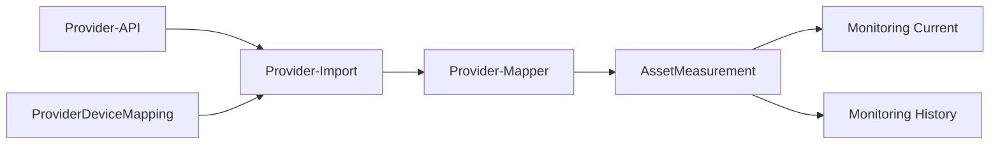

# Provider-zu-AssetMeasurement-Pipeline

## Zweck

Die Pipeline überführt Live-Messwerte der Provider Weyland und HEAT in das kanonische ZERO-Modell `AssetMeasurement`.

## Datenfluss

## Verantwortlichkeiten

- Der Provider-Import ruft die externe API auf.
- Der Provider-Mapper transformiert das Quellformat.
- `ProviderDeviceMapping` ordnet Providergeräte internen Assets zu.
- `persistMeasurements` speichert normalisierte Messwerte.
- Die Monitoring-Endpunkte stellen die Messwerte providerunabhängig bereit.

## Kanonische Messgrößen

| Messgröße | Einheit |
|---|---|
| `grid_power` | `kW` |
| `pv_power` | `kW` |
| `load_power` | `kW` |
| `battery_power` | `kW` |
| `battery_soc` | `%` |
| `heat_pump_power` | `kW` |

## Provider-Mapping

| Provider | Quellfeld | Quell-Einheit | Zieltyp | Ziel-Einheit |
|---|---|---|---|---|
| Weyland | `power.grid` | W | `grid_power` | kW |
| Weyland | `power.pv` | W | `pv_power` | kW |
| Weyland | `power.battery` | W | `battery_power` | kW |
| Weyland | `power.load` | W | `load_power` | kW |
| HEAT | `assets.grid.activePowerkW` | kW | `grid_power` | kW |
| HEAT | `assets.solar.activePowerkW` | kW | `pv_power` | kW |
| HEAT | `assets.bess.activePowerkW` | kW | `battery_power` | kW |
| HEAT | `assets.load.activePowerkW` | kW | `load_power` | kW |
| HEAT | `assets.heatpump.activePowerkW` | kW | `heat_pump_power` | kW |
| HEAT | `assets.bess.soc` | % | `battery_soc` | % |

## Zeitstempel

HEAT stellt mit `reportedAt` einen Beobachtungszeitpunkt bereit. Dieser wird als `observedAt` gespeichert. Falls kein gültiger Providerzeitstempel verfügbar ist, wird der Abrufzeitpunkt verwendet.

Weyland stellt im verwendeten Overview-Endpunkt keinen Messzeitpunkt bereit. Deshalb wird der Abrufzeitpunkt als `observedAt` gespeichert.

`createdAt` bezeichnet unabhängig davon den Zeitpunkt der Persistierung in ZERO.

## Datenqualität

Nur endliche numerische Werte werden gespeichert. Prozentwerte werden nur im Bereich von 0 bis 100 akzeptiert. Erfolgreich validierte Datensätze erhalten den Qualitätsstatus `VALID`.

## Sicherheit

Der Import-Endpunkt ist ausschließlich für angemeldete Administratoren zugänglich. Zugangsdaten werden über Umgebungsvariablen bereitgestellt und nicht in Messwerten, Antworten oder Dokumentationsdateien gespeichert.